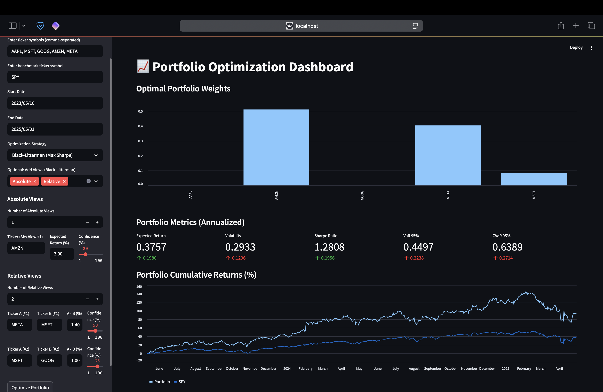

# 📈 Portfolio Optimization Dashboard


An **interactive dashboard** for portfolio optimization strategies — from classic mean-variance to Black-Litterman with custom investor views.

## 🚀 Features

- 📊 Portfolio optimization strategies:
  - Minimum Variance
  - Maximum Sharpe Ratio
  - Equal Weight
  - **Black-Litterman** (with custom absolute & relative views + confidence levels)

- 🧠 Investor view inputs (for Black-Litterman):
  - Absolute views (e.g., "AAPL will return 10%")
  - Relative views (e.g., "AAPL will outperform MSFT by 3%")
  - Adjustable confidence levels for each view

- 📆 Historical portfolio performance plot
- 📎 Benchmark comparison (e.g., SPY)
- 🌐 Fully interactive via [Streamlit](https://streamlit.io/)


##  🌐 Web App
To run the app:

```bash
streamlit run stream.py
```

## 📸 Screenshots




## 💡 To-Do 

- [ ] CVaR Optimization (Historical + Monte Carlo)
- [ ] Sector / ESG filtering


## 📁 File structure
- `strategy.py`- Retrieve data and implement optimization strategy.
- `stream.py`- Builds an interactive web app using Streamlit to visualize the dashboard.
- `dashboard_preview.png` - Screenshot
- `README.md`- Project documentation.

